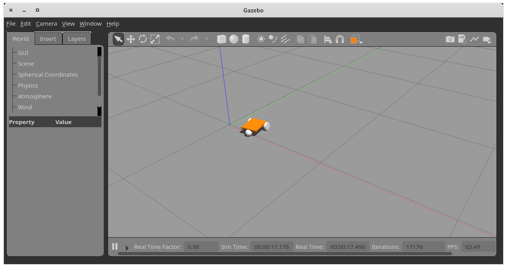

# AliveOS Feature Demonstration ROS Package

Package contains code for a simple demonstration of the data exchange withing AliveOS

## How to run

Source environment of your catkin workspace, e.g.:

```bash
source ./catkin_workspace/devel/setup.bash
```

And then run:

```bash
roslaunch aliveos_demo simple_demo.launch
```

You will see the gazebo setup launched with a simple robot driven by the code in the package:



## References

- Used code from [github.com/richardw05/mybot_ws](https://github.com/richardw05/mybot_ws) by [Richard Wang](https://github.com/richardw05) (c) 2020

---

## [](https://github.com/an-dr/aliveos)

This repository is part of the [AliveOS](https://github.com/an-dr/aliveos) project.
